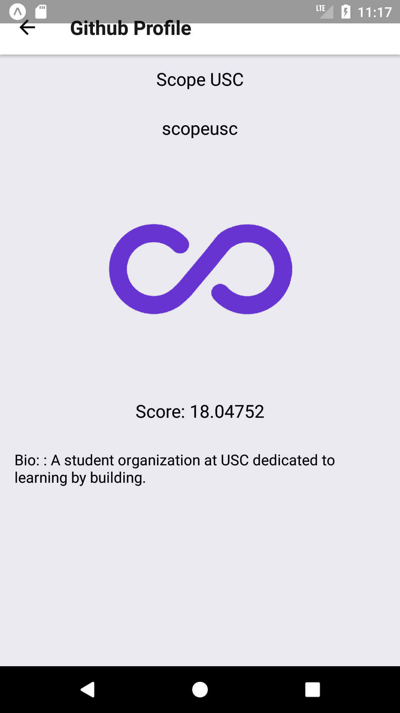

# Librarian

This is a updated version of the Librarian App from Scope Lesson 3.

Updates include:
* Instead of Google books API, this app has been configured to work with Github public API- simply search for a user and see their real name, username, github profile score, their bio and avatar.
* Instead of one `fetch` API call in react native, this app performs two- one to search for the user, and one to get user-specific information such as their real name and bio.

#### Scope example screenshot

  

